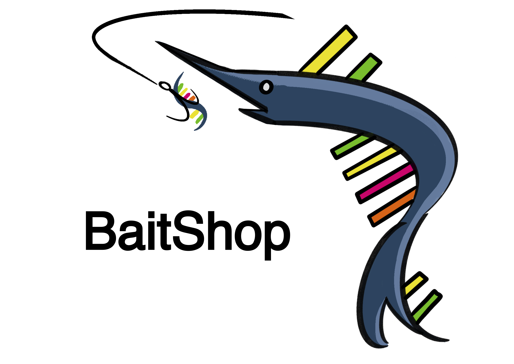

# BaitShop

An all-in-one solution for MERFISH probe design!

Includes methods for isoform selection, HD4 codebook design, barcode assignment to genes, and oligonucleotide probe design.

Exports a fasta file containing the full probe sequences.

To install:

```
conda create -n MERFISH_probe_design python=3.10 -y
conda activate MERFISH_probe_design
git clone https://github.com/mikejdeines/BaitShop
cd BaitShop
pip install .
```

This package was built using python 3.10.16 on macOS 15.4.1, and has been tested on Rocky Linux 9, Ubuntu 22.04.5 and macOS 26.1.

Example notebooks include codebook design for a 100 gene panel and probe design for _Mus musculus_ _Rorb_, _Cux2_, and _Rbp4_.
